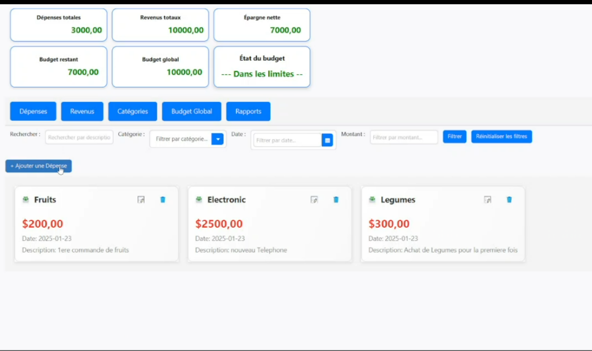

<a id="readme-top"></a>

<!-- PROJECT LOGO -->
<br />
<div align="center">
 

  <h3 align="center">BudgetPlanner</h3>

  <p align="center">
    A Personal Expense Tracking System dedicated to helping users efficiently manage their finances by recording expenses, setting budgets, and visualizing spending patterns.
  </p>
</div>

<!-- TABLE OF CONTENTS -->
<details>
  <summary>Table of Contents</summary>
  <ol>
    <li>
      <a href="#about-the-project">About The Project</a>
      <ul>
        <li><a href="#built-with">Built With</a></li>
      </ul>
    </li>
    <li><a href="#screenshots">Screenshots</a></li>
    <li>
      <a href="#getting-started">Getting Started</a>
      <ul>
        <li><a href="#prerequisites">Prerequisites</a></li>
        <li><a href="#installation">Installation</a></li>
      </ul>
    </li>
    <li><a href="#contact">Contact</a></li>
  </ol>
</details>

<!-- ABOUT THE PROJECT -->
## About The Project

<a href="https://github.com/Hamza-Alali-0/BudgetPlanner">
    
</a>

BudgetPlanner is a comprehensive personal expense tracking application designed to help you manage your spending habits and monitor your budgets. It enables you to:

- **Record Expenses**: Add new transactions with details such as amount, date, category, and description.
- **Manage Transactions**: Edit or delete recorded expenses, with a confirmation step to prevent accidental removal.
- **Organize Spending**: Categorize expenses (e.g., Food, Transport, Entertainment, Housing) and filter them by date, category, or amount.
- **Budgeting**: Set a global monthly budget and individual category budgets, with alerts when you approach or exceed your limits.
- **Visual Analytics**: View detailed dashboards and charts showing expense distributions and monthly spending trends.
- **Income Tracking**: Record income sources and track net savings month-by-month.
- **Notifications**: Receive alerts for budget thresholds and periodic reminders to log your expenses.

### Built With

This project is built with the following technologies:
* [![Java][Java.com]][Java-url]
* [![JavaFX][JavaFX.com]][JavaFX-url]
* [![MySQL][MySQL.com]][MySQL-url]

<!-- Reference-style links for images -->
[Java.com]: https://img.shields.io/badge/Java-007396?style=for-the-badge&logo=java&logoColor=white
[Java-url]: https://www.java.com/
[JavaFX.com]: https://img.shields.io/badge/JavaFX-E24100?style=for-the-badge&logo=java&logoColor=white
[JavaFX-url]: https://openjfx.io/
[MySQL.com]: https://img.shields.io/badge/MySQL-4479A1?style=for-the-badge&logo=mysql&logoColor=white
[MySQL-url]: https://www.mysql.com/


<p align="right">(<a href="#readme-top">back to top</a>)</p>

<!-- SCREENSHOTS -->
## Screenshots

Here are some screenshots of the project:

| ![expanse Page][expanse-screenshot] | ![revenue Page][revenue-screenshot] | ![category Page][category-screenshot] |
|-------------------------------|----------------------------------|----------------------------------|
| **expanse Page**                 | **revenue Page**                  | **category Page**                  |

<!-- Reference-style links for images -->
[expanse-screenshot]: Assets/expanse.PNG
[revenue-screenshot]: Assets/revenue.PNG
[category-screenshot]: Assets/category.PNG

<p align="right">(<a href="#readme-top">back to top</a>)</p>


<!-- GETTING STARTED -->
## Getting Started

To get a local copy up and running, follow these steps.

### Prerequisites

Before you begin, ensure you have the following installed:

- **Java Development Kit (JDK)**  
  - Version 11 or higher is recommended.  
  - Download it from [Oracle JDK](https://www.oracle.com/java/technologies/javase-jdk11-downloads.html) or [OpenJDK](https://openjdk.org/projects/jdk/11/).

- **JavaFX SDK**  
  - Download the JavaFX SDK from [Gluon's OpenJFX](https://gluonhq.com/products/javafx/).  
  - Configure it in your IDE or build tool by adding the JavaFX modules to your project's classpath.

- **MySQL Database**  
  - Install MySQL Server (version 8.0 or higher).  
  - Download it from [MySQL Downloads](https://dev.mysql.com/downloads/mysql/).  
  - Ensure the MySQL server is running, and create a database for the project.

- **IDE or Text Editor**  
  - Use an IDE like [IntelliJ IDEA](https://www.jetbrains.com/idea/), [Eclipse](https://www.eclipse.org/), or [NetBeans](https://netbeans.apache.org/).  
  - Alternatively, use a text editor like [VS Code](https://code.visualstudio.com/) with appropriate Java extensions installed.


### Installation

1. **Clone the repository**
   ```sh
   git clone https://github.com/Hamza-Alali-0/BudgetPlanne.git

2. **Import the sql Database to Xampp(mySql)**:
  - gestion_depenses.sql.


<a id="contact"></a>
## Contact

Hamza Alali - [hamza.alali.dev@gmail.com](mailto:hamza.alali.dev@gmail.com)


Connect with me:
- <a href="https://dev.to/@hamzaalali0" target="_blank"></a>
- <a href="https://www.linkedin.com/in/hamza--alali" target="_blank"></a>
- <a href="https://github.com/hamza-alali-0" target="_blank"></a>
- <a href="https://www.instagram.com/alalihamza.0/" target="_blank"></a>

Project Link: [https://github.com/Hamza-Alali-0/BudgetPlanner](https://github.com/Hamza-Alali-0/BudgetPlanner)

<p align="right">(<a href="#readme-top">back to top</a>)</p>
   
